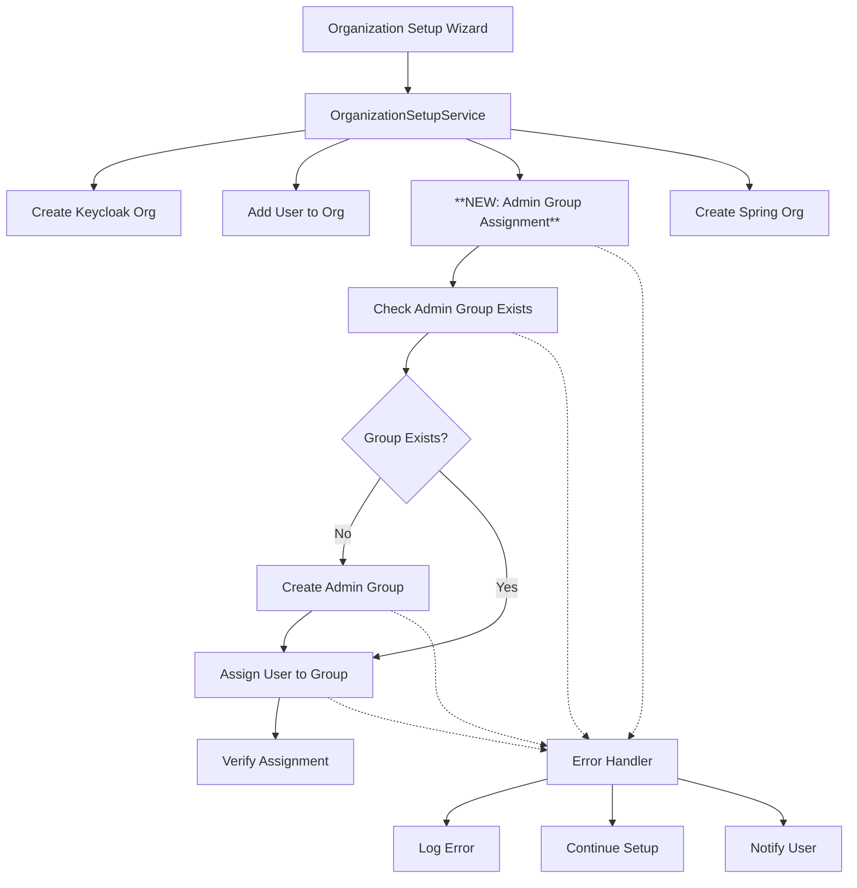

# Design Document - Admin Group Assignment Fix

## Overview

This document outlines the technical design for fixing the critical issue where newly created users during organization setup are not being automatically assigned to the "Admins" group in Keycloak. The solution will extend the existing `OrganizationSetupService` to include automatic admin group assignment while maintaining backward compatibility and integrating seamlessly with the current organization setup flow.

## Code Reuse Analysis

### Existing Components to Leverage

**Primary Service Layer:**
- `OrganizationSetupService` (`src/services/organization/organization-setup.service.ts`) - Main service that orchestrates organization creation
- `useOrganizationSetup` hook (`src/hooks/useOrganizationSetup.ts`) - React hook managing organization setup state

**Keycloak Integration Layer:**
- Generated API clients from `src/core/api/generated/keycloak/`:
  - `getAdminRealmsRealmGroups` - Query existing groups
  - `postAdminRealmsRealmGroups` - Create new groups
  - `putAdminRealmsRealmUsersUserIdGroupsGroupId` - Assign users to groups
- `keycloakService` (`src/core/api/services/keycloak-service/`) - Unified Keycloak admin service
- API routes in `src/app/api/keycloak/` - Existing Keycloak endpoints

**Existing Group Management Patterns:**
- Group assignment logic in `src/app/api/keycloak/organizations/[organizationId]/members/route.ts`
- Group querying patterns in `src/app/api/keycloak/groups/route.ts`
- User-group management in `src/app/api/keycloak/users/[userId]/groups/route.ts`

**Error Handling & Logging:**
- Console logging patterns used throughout organization setup
- Error handling with try-catch blocks and graceful degradation
- Toast notifications using `sonner` library (as seen in `useOrganizationSetup`)

**Integration Points:**
- Progress tracking component (`OrganizationSetupProgress.tsx`)
- Setup wizard and form components
- Session management through NextAuth.js

## Architecture

### System Architecture



### Integration Flow

The admin group assignment will be integrated into the existing organization setup flow:

1. **Current Flow Steps:**
   - Get Keycloak user ID
   - Create Keycloak organization
   - Add user as organization member
   - Create Spring organization record

2. **Enhanced Flow (New Step 3.5):**
   - Get Keycloak user ID
   - Create Keycloak organization
   - Add user as organization member
   - **→ [NEW] Assign user to Admin group**
   - Create Spring organization record

## Components and Interfaces

### Enhanced OrganizationSetupService

**New Methods:**
```typescript
class OrganizationSetupService {
  // Existing methods...
  
  /**
   * Ensure admin group exists and assign user to it
   * NEW METHOD
   */
  private async assignUserToAdminGroup(
    orgId: string, 
    userId: string
  ): Promise<AdminGroupAssignmentResult>
  
  /**
   * Find or create the admin group for organization
   * NEW METHOD
   */
  private async ensureAdminGroupExists(
    orgId: string
  ): Promise<GroupRepresentation>
  
  /**
   * Verify user is assigned to admin group
   * NEW METHOD
   */
  private async verifyAdminGroupAssignment(
    userId: string, 
    groupId: string
  ): Promise<boolean>
}
```

**Enhanced Setup Result:**
```typescript
export interface OrganizationSetupResult {
  keycloakOrgId: string;
  springOrgId: number;
  adminGroupAssignment?: AdminGroupAssignmentResult; // NEW
}

export interface AdminGroupAssignmentResult {
  success: boolean;
  groupId?: string;
  groupName: string;
  wasCreated: boolean;
  error?: string;
  retryAttempted?: boolean;
}
```

### New Admin Group Management Service

**Location:** `src/services/organization/admin-group.service.ts`

```typescript
export class AdminGroupService {
  private static readonly ADMIN_GROUP_NAME = 'Admins';
  private static readonly MAX_RETRIES = 1;
  
  /**
   * Main entry point for admin group assignment
   */
  async assignUserToAdminGroup(
    orgId: string, 
    userId: string
  ): Promise<AdminGroupAssignmentResult>
  
  /**
   * Find existing admin group by name (case-insensitive)
   */
  async findAdminGroup(): Promise<GroupRepresentation | null>
  
  /**
   * Create new admin group
   */
  async createAdminGroup(): Promise<GroupRepresentation>
  
  /**
   * Assign user to specific group with retry logic
   */
  async assignUserToGroup(
    userId: string, 
    groupId: string
  ): Promise<void>
  
  /**
   * Verify user is assigned to group
   */
  async verifyUserGroupAssignment(
    userId: string, 
    groupId: string
  ): Promise<boolean>
}
```

### API Route Extensions

**Enhanced Members Route:**
The existing `/api/keycloak/organizations/[organizationId]/members/route.ts` will be extended to support admin group assignment during the simple member addition flow (used by organization setup).

```typescript
// Enhanced POST handler for member addition
export async function POST(request: NextRequest, { params }) {
  // ... existing permission checks ...
  
  if (body.userId && !body.email && body.assignAdminRole) {
    // NEW: Admin assignment during org setup
    await postAdminRealmsRealmOrganizationsOrgIdMembers(realm, organizationId, body.userId);
    
    // NEW: Assign to admin group
    const adminGroupResult = await adminGroupService.assignUserToAdminGroup(
      organizationId, 
      body.userId
    );
    
    return NextResponse.json({
      message: 'User added to organization successfully',
      organizationId,
      userId: body.userId,
      adminGroupAssignment: adminGroupResult // NEW
    });
  }
  
  // ... existing invitation flow ...
}
```

## Data Models

### Group Representation (Existing)
Leveraging existing Keycloak `GroupRepresentation` type from generated API clients:

```typescript
interface GroupRepresentation {
  id?: string;
  name?: string;
  path?: string;
  attributes?: Record<string, string[]>;
  realmRoles?: string[];
  clientRoles?: Record<string, string[]>;
  subGroups?: GroupRepresentation[];
  access?: Record<string, boolean>;
}
```

### Admin Group Assignment Models (New)

```typescript
interface AdminGroupAssignmentRequest {
  organizationId: string;
  userId: string;
  groupName?: string; // Default: "Admins"
}

interface AdminGroupAssignmentResult {
  success: boolean;
  groupId?: string;
  groupName: string;
  wasCreated: boolean;
  error?: string;
  retryAttempted?: boolean;
  verificationPassed?: boolean;
}

interface AdminGroupVerificationResult {
  userAssigned: boolean;
  groupExists: boolean;
  assignmentTimestamp?: number;
  error?: string;
}
```

## Error Handling

### Error Categories and Responses

**1. Group Query Errors:**
```typescript
try {
  const groups = await getAdminRealmsRealmGroups(realm, { search: 'Admins' });
} catch (error) {
  console.error('Failed to query admin groups:', error);
  // Continue with group creation
}
```

**2. Group Creation Errors:**
```typescript
try {
  await postAdminRealmsRealmGroups(realm, adminGroupData);
} catch (error) {
  if (error.status === 409) {
    // Group already exists, retry query
    return await this.findAdminGroup();
  }
  throw new AdminGroupError('Failed to create admin group', error);
}
```

**3. User Assignment Errors:**
```typescript
try {
  await putAdminRealmsRealmUsersUserIdGroupsGroupId(realm, userId, groupId);
} catch (error) {
  if (retryCount < MAX_RETRIES) {
    await this.delay(1000 * (retryCount + 1)); // Exponential backoff
    return this.assignUserToGroup(userId, groupId, retryCount + 1);
  }
  throw new AdminGroupError('Failed to assign user to admin group', error);
}
```

### Error Handling Strategy

**Graceful Degradation:**
- Admin group assignment failures DO NOT prevent organization setup completion
- Errors are logged with detailed context for debugging
- Users receive clear notification about partial setup completion

**Retry Logic:**
- Single retry for group creation (in case of race conditions)
- Exponential backoff for user assignment operations
- Verification step after assignment with retry capability

**Logging Strategy:**
```typescript
const logContext = {
  operation: 'admin_group_assignment',
  organizationId,
  userId,
  groupName: 'Admins',
  timestamp: new Date().toISOString(),
  error: error.message,
  stack: error.stack
};

console.error('Admin group assignment failed:', logContext);
```

## Testing Strategy

### Unit Testing

**Test Files:**
- `src/services/organization/__tests__/admin-group.service.test.ts`
- `src/services/organization/__tests__/organization-setup.service.test.ts` (enhanced)

**Test Scenarios:**
```typescript
describe('AdminGroupService', () => {
  describe('assignUserToAdminGroup', () => {
    it('should create admin group if it does not exist')
    it('should use existing admin group if found')
    it('should handle case-insensitive group search')
    it('should retry on assignment failure')
    it('should verify assignment after success')
    it('should handle concurrent group creation (409 conflicts)')
  })
})

describe('OrganizationSetupService - Admin Group Integration', () => {
  it('should assign admin group during successful organization setup')
  it('should continue setup even if admin assignment fails')
  it('should include admin assignment result in setup response')
  it('should handle timeout scenarios gracefully')
})
```

### Integration Testing

**API Route Tests:**
- Test enhanced members route with admin assignment
- Verify backward compatibility with existing member addition
- Test error scenarios and partial failures

**End-to-End Testing:**
- Complete organization setup flow with admin assignment
- Verify user has both organization membership and admin group assignment
- Test setup completion with various error conditions

### Manual Testing Checklist

**Setup Flow Verification:**
- [ ] New organization creator receives admin group assignment
- [ ] Setup completes successfully with admin assignment
- [ ] Setup completes successfully even if admin assignment fails
- [ ] Progress tracking shows admin assignment step
- [ ] Error notifications appear for partial failures

**Group Management Verification:**
- [ ] Admin group is created if it doesn't exist
- [ ] Existing admin group is reused if found
- [ ] Case-insensitive group search works correctly
- [ ] User assignment is verified after completion

## Implementation Plan

### Phase 1: Core Service Implementation
1. Create `AdminGroupService` with group management logic
2. Implement group querying, creation, and assignment methods
3. Add comprehensive error handling and retry logic
4. Include verification capabilities

### Phase 2: Integration with Organization Setup
1. Enhance `OrganizationSetupService` to include admin group assignment
2. Add admin assignment step to the setup flow (after user membership)
3. Update setup result types to include admin assignment information
4. Ensure backward compatibility

### Phase 3: API Route Enhancement
1. Extend members API route to support admin assignment flag
2. Add admin group assignment to simple member addition flow
3. Maintain existing invitation flow functionality
4. Add appropriate response enhancements

### Phase 4: Error Handling & Logging
1. Implement comprehensive error handling strategy
2. Add detailed logging for troubleshooting
3. Ensure graceful degradation for setup completion
4. Add user notification for partial failures

### Phase 5: Testing & Validation
1. Write comprehensive unit tests for new services
2. Add integration tests for enhanced API routes
3. Perform end-to-end testing of complete setup flow
4. Validate error scenarios and edge cases

This design leverages the existing codebase architecture while extending it with the necessary admin group assignment functionality. The solution maintains backward compatibility, follows established patterns, and provides robust error handling to ensure organization setup reliability.