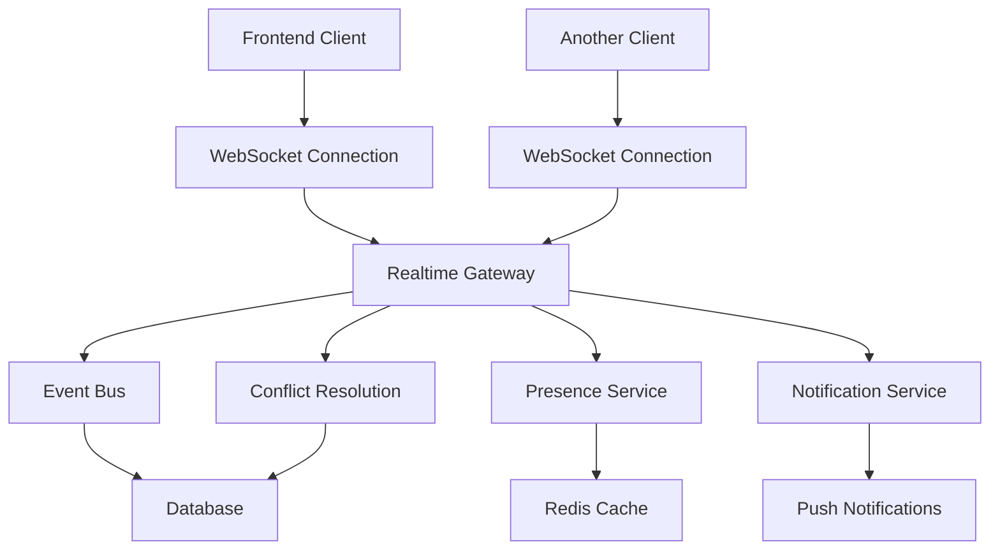

# Realtime Collaboration Design Document

## Overview

This design implements comprehensive realtime collaboration capabilities for the CRM Frontend, enabling multiple users to work simultaneously on customer data, calls, and meetings with live synchronization, presence indicators, and conflict resolution.

## Steering Document Alignment

### Technical Standards (tech.md)
Following established Next.js 15 + Turbopack architecture with TypeScript, maintaining current patterns for state management using TanStack Query, and leveraging existing authentication through NextAuth.js v5.

### Project Structure (structure.md)
Implementing realtime features using the existing feature-based directory structure with small, focused components in dedicated directories under `src/app/(protected)/(features)/shared/realtime/`.

## Architecture

The realtime collaboration system follows a client-server architecture using WebSocket connections for bi-directional communication, with fallback to Server-Sent Events (SSE) and polling mechanisms.



## Components and Interfaces

### 1. WebSocket Manager
**Purpose:** Manages WebSocket connections, reconnection logic, and message routing
**Location:** `src/core/realtime/websocket-manager.ts`

```typescript
interface WebSocketManager {
  connect(): Promise<void>
  disconnect(): void
  subscribe(channel: string, callback: EventCallback): void
  unsubscribe(channel: string, callback: EventCallback): void
  send(message: RealtimeMessage): void
  getConnectionStatus(): ConnectionStatus
}
```

### 2. Realtime Provider
**Purpose:** React context provider for realtime functionality
**Location:** `src/core/realtime/realtime-provider.tsx`

```typescript
interface RealtimeContextValue {
  isConnected: boolean
  presence: PresenceState
  subscribe: (event: string, handler: EventHandler) => void
  emit: (event: string, data: any) => void
  joinRoom: (roomId: string) => void
  leaveRoom: (roomId: string) => void
}
```

### 3. Presence Component
**Purpose:** Shows user presence indicators
**Location:** `src/app/(protected)/(features)/shared/realtime/components/presence-indicator.tsx`

```typescript
interface PresenceIndicatorProps {
  roomId: string
  showCurrentUser?: boolean
  maxVisible?: number
  position?: 'top-right' | 'bottom-left' | 'floating'
}
```

### 4. Live Data Sync Hook
**Purpose:** Custom hook for syncing data in real-time
**Location:** `src/app/(protected)/(features)/shared/realtime/hooks/use-live-data.ts`

```typescript
interface UseLiveDataOptions<T> {
  key: string
  initialData?: T
  onUpdate?: (data: T) => void
  onConflict?: (local: T, remote: T) => T
}
```

### 5. Notification System
**Purpose:** Real-time notifications and alerts
**Location:** `src/app/(protected)/(features)/shared/realtime/components/notification-center.tsx`

```typescript
interface NotificationCenterProps {
  position?: 'top-right' | 'top-left' | 'bottom-right' | 'bottom-left'
  maxNotifications?: number
  autoHideDuration?: number
}
```

### 6. Conflict Resolution Modal
**Purpose:** UI for resolving data conflicts
**Location:** `src/app/(protected)/(features)/shared/realtime/components/conflict-resolution-modal.tsx`

```typescript
interface ConflictResolutionProps<T> {
  isOpen: boolean
  localData: T
  remoteData: T
  onResolve: (resolvedData: T) => void
  onCancel: () => void
}
```

### 7. Activity Feed
**Purpose:** Live activity stream component  
**Location:** `src/app/(protected)/(features)/shared/realtime/components/activity-feed.tsx`

```typescript
interface ActivityFeedProps {
  feedType: 'user' | 'customer' | 'global'
  entityId?: string
  maxItems?: number
  filters?: ActivityFilter[]
}
```

### 8. Collaborative Form Wrapper
**Purpose:** Wraps forms to enable real-time collaboration
**Location:** `src/app/(protected)/(features)/shared/realtime/components/collaborative-form.tsx`

```typescript
interface CollaborativeFormProps {
  formId: string
  entityType: string
  entityId: string
  children: React.ReactNode
  onConflict?: ConflictHandler
}
```

## Data Models

### RealtimeMessage
```typescript
interface RealtimeMessage {
  id: string
  type: MessageType
  event: string
  data: any
  timestamp: number
  userId: string
  organizationId: string
  room?: string
}

type MessageType = 'data_update' | 'presence_update' | 'notification' | 'conflict' | 'system'
```

### PresenceState
```typescript
interface PresenceState {
  users: PresenceUser[]
  currentUser: PresenceUser
  totalCount: number
}

interface PresenceUser {
  id: string
  name: string
  avatar?: string
  status: 'online' | 'away' | 'busy'
  lastSeen: Date
  currentPage?: string
  isEditing?: boolean
  editingField?: string
}
```

### ActivityEvent
```typescript
interface ActivityEvent {
  id: string
  type: ActivityType
  entityType: string
  entityId: string
  userId: string
  userName: string
  action: string
  changes?: FieldChange[]
  timestamp: Date
  metadata?: Record<string, any>
}

type ActivityType = 'create' | 'update' | 'delete' | 'view' | 'comment'
```

### ConflictData
```typescript
interface ConflictData<T> {
  id: string
  entityType: string
  entityId: string
  localVersion: T
  remoteVersion: T
  conflictedFields: string[]
  timestamp: Date
  resolvedBy?: string
  resolution?: 'local' | 'remote' | 'merged'
}
```

## Error Handling

### Connection Error Scenarios

1. **WebSocket Connection Lost**
   - **Handling:** Automatic reconnection with exponential backoff
   - **User Impact:** Show connection status indicator, queue messages locally

2. **Authentication Failure**
   - **Handling:** Redirect to login page, clear stored session
   - **User Impact:** Login prompt with session expired message

3. **Permission Denied**
   - **Handling:** Show error message, disable realtime features
   - **User Impact:** Read-only mode with explanation

4. **Network Throttling**
   - **Handling:** Reduce message frequency, batch updates
   - **User Impact:** Slightly delayed updates with status indicator

### Data Conflict Scenarios

1. **Simultaneous Edits**
   - **Handling:** Conflict resolution modal with field-level comparison
   - **User Impact:** Choose between versions or merge changes

2. **Deleted Entity Updates**
   - **Handling:** Show entity not found error, refresh data
   - **User Impact:** Notification that entity was deleted by another user

3. **Permission Changes**
   - **Handling:** Update UI permissions immediately, show notification
   - **User Impact:** Fields become read-only with explanation

## Testing Strategy

### Unit Testing
- **WebSocket Manager**: Connection logic, message handling, reconnection
- **Realtime Hooks**: Data synchronization, conflict detection
- **Components**: Presence indicators, notifications, conflict resolution UI
- **Services**: Message routing, data transformation, error handling

### Integration Testing
- **API Integration**: WebSocket server communication
- **Authentication Flow**: Token validation, session management
- **Database Sync**: Data consistency across multiple clients
- **Performance**: Memory usage, connection limits, message throughput

### End-to-End Testing
- **Multi-user scenarios**: Two browser instances testing collaboration
- **Network conditions**: Connection drops, slow networks, timeouts
- **Conflict resolution**: Simultaneous edits, merge scenarios
- **Cross-browser**: WebSocket support, fallback mechanisms

## Implementation Phases

### Phase 1: Foundation (Week 1-2)
- Set up WebSocket infrastructure
- Implement basic connection management
- Create realtime provider and context
- Basic presence tracking

### Phase 2: Data Synchronization (Week 3-4)
- Implement live data sync hooks
- Add conflict detection
- Create notification system
- Basic activity tracking

### Phase 3: Collaborative Features (Week 5-6)
- Collaborative form editing
- Conflict resolution UI
- Advanced presence features
- Performance optimization

### Phase 4: Polish & Testing (Week 7-8)
- Comprehensive testing suite
- Error handling improvements
- Documentation and guides
- Performance monitoring

## Security Considerations

### Authentication & Authorization
- All WebSocket connections must be authenticated
- Message-level authorization based on user permissions
- Organization-level data isolation
- Rate limiting to prevent abuse

### Data Protection
- Encrypt sensitive data in transit
- Validate all incoming messages
- Sanitize user-generated content
- Audit trail for all realtime activities

### Privacy
- Presence information respects privacy settings
- Activity feeds filter based on permissions
- No cross-organization data leakage
- GDPR compliance for user activity data

## Performance Optimization

### Connection Management
- Connection pooling for high-traffic scenarios
- Automatic cleanup of inactive connections
- Graceful degradation under load
- Regional WebSocket servers for global users

### Data Optimization
- Message compression for large payloads
- Batching of frequent updates
- Selective data synchronization
- Efficient conflict detection algorithms

### Client-Side Optimization
- Virtual scrolling for activity feeds
- Debounced user input for presence updates
- Lazy loading of presence data
- Memory management for long-running sessions

## Monitoring & Analytics

### Connection Metrics
- Active connection count
- Connection duration distribution
- Reconnection frequency
- Geographic distribution

### Feature Usage
- Presence feature adoption
- Conflict resolution patterns
- Notification engagement
- Activity feed usage

### Performance Metrics
- Message latency
- Memory usage trends
- Error rates by type
- User satisfaction scores

---

This design provides a comprehensive foundation for implementing realtime collaboration while maintaining compatibility with the existing CRM architecture and ensuring scalability for future growth.